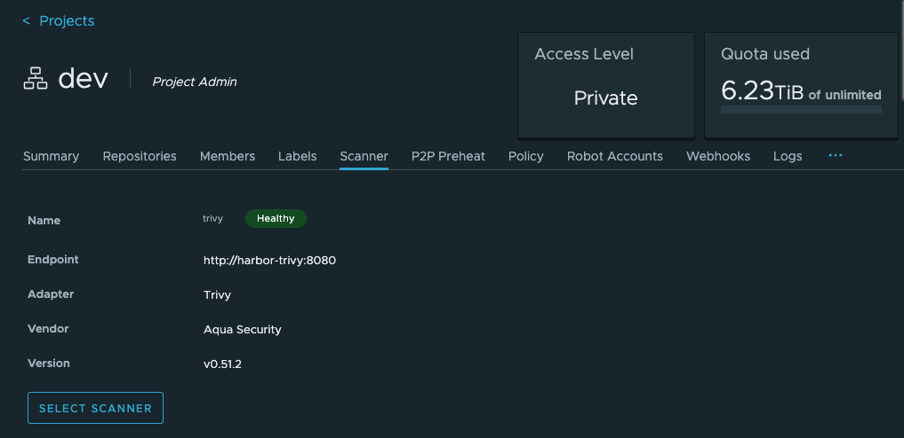

# [Harbor] 2. 이미지 취약점 대응을 위한 스캐너 설정 여부

## Menu 
Projects > Scanner 
Projects > Configuration

## 점검 방법 
**Scanner** 탭에서 하버 내 이미지에 대한 취약점 스캐닝을 위한 `Trivy`, `Clair` 등 프로젝트 별 스캐너 활성화(_**Healthy**_) 여부를 검토합니다.

**Configuration** 탭 내 **Vulnerability scanning**의 `Automatically scan images on push` 체크를 통한 푸시 발생 시 이미지 스캔 자동화 여부를 검토합니다. 

## 관련 통제 항목 (ISMS-P)
- 2.8.2 보안 요구사항 검토 및 시험
- 2.10.1 보안시스템 운영
- 2.11.2 취약점 점검 및 조치