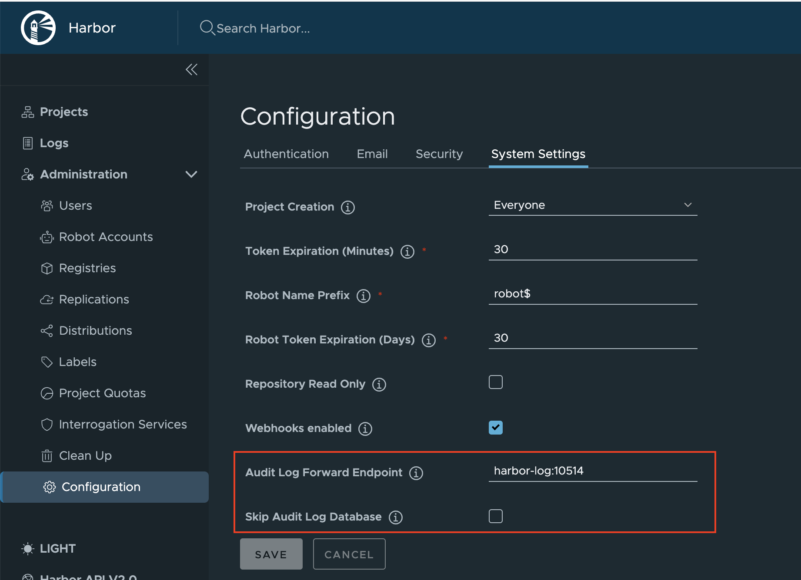

# [Harbor] 6. 로그 별도 보관 여부

## Menu 
Administration > Configuration > System Settings

## 점검 방법 
Audit Log Forward Endpoint 옵션을 확인하여 로그 보관 주기에 맞게 보관 되도록 별도로 로그를 전송하여 보관하고 있는지 점검합니다.   

## 관련 통제 항목 (ISMS-P)
- 2.9.4 로그 및 접속기록 관리