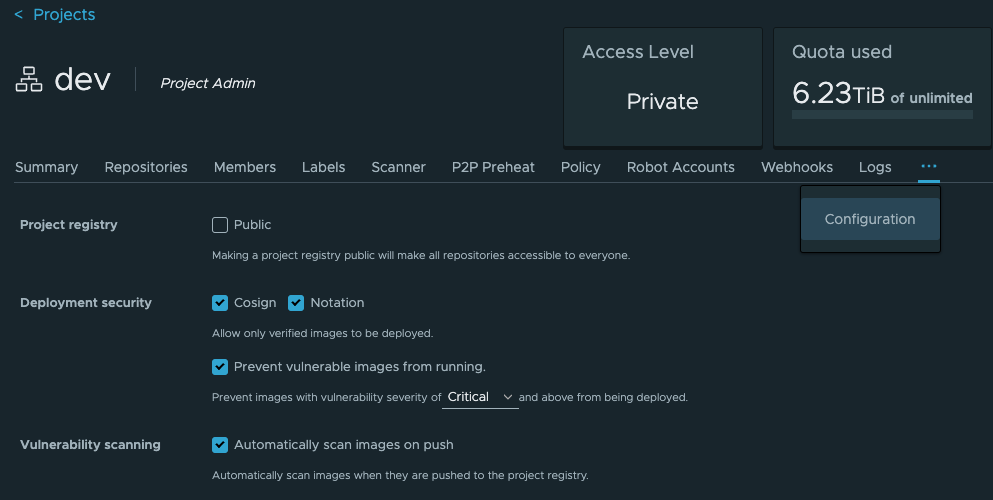

# [Harbor] 7. 아티팩트의 무결성 검증 관리 여부

## Menu 
Projects > Configuration

## 점검 방법 
아티팩트의 무결성 검증, 취약한 이미지 실행 방지를 위한 **Deployment security** 설정 활성화 여부를 검토합니다. 

- 아티팩트 서명을 위한 **Cosign** 설치 및 활성화;
- 원격 Docker 레지스트리 상 이미지 서명을 위한 **Notation** 설치 및 활성화; 
- 특정 수준(`High`, `Critical` 등) 이상의 취약점을 포함한 이미지의 배포 방지를 위한 **Prevent vulnerable images from running** 활성화

## 관련 통제 항목 (ISMS-P)
- 2.8.2 보안 요구사항 검토 및 시험
- 2.11.1 사고 예방 및 대응체계 구축
- 2.11.2 취약점 점검 및 조치