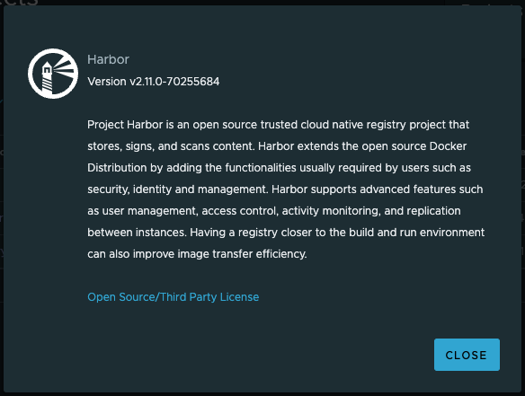

# [Harbor] 9. 서비스 버전 업데이트 최신화 여부

## Menu 
About

## 점검 방법 
우측 상단의 사용자 프로필 하단의 About으로 조회 시 해당 제품의 버전을 조회하여 최신화 관리가 되고 있는지 검토합니다. 

- 최신 버전 확인: https://github.com/goharbor/harbor/releases

## 관련 통제 항목 (ISMS-P)
- 2.9.1 변경관리
- 2.10.1 보안시스템 운영
- 2.10.8 패치관리