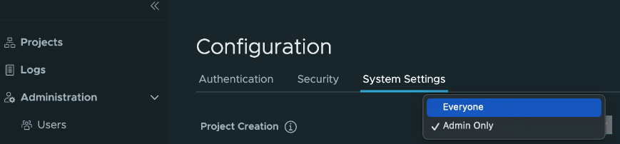

# [Harbor] 10. Project 생성 권한 검토

## Menu 
Administration > Configuration > System Settings

## 점검 방법 
**Project Creation** 권한 설정을 점검하여 `Admin Only`로 설정되어 있는지 확인합니다.  
`Everyone`으로 되어 있는 경우 해당 옵션 변경 승인 내역을 검토합니다.

## 관련 통제 항목 (ISMS-P)
- 2.9.1 변경관리
- 2.10.2 클라우드 보안