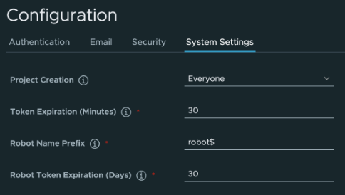

# [Harbor] 11. 토큰 만료 시간 점검

## Menu 
Administration > Configuration > System Settings

## 점검 방법 
토큰 만료시간 설정이 적정한 수준을 준수하는지 검토합니다.

- Token Expiration (Minutes)
- Robot Token Expiration (Days)

## 관련 통제 항목 (ISMS-P)
- 2.5.1 사용자 계정 관리
- 2.10.1 보안시스템 운영
- 2.10.2 클라우드 보안