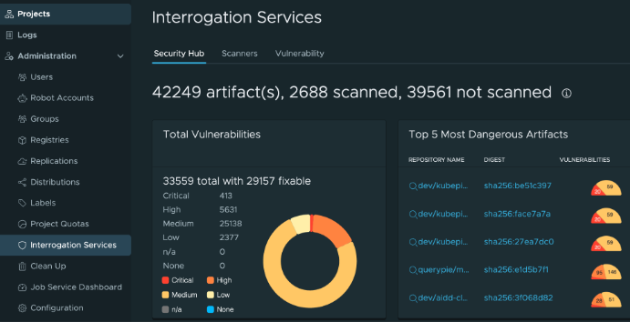

# [Harbor] 13. 자산 별 취약점 관리 현황 검토

## Menu 
Administration > Interrogation Services

## 점검 방법 
각 자산별 취약점 현황에 따른 점검, 조치 또는 위험수용 프로세스 이행하고 있는지 검토합니다. 

- VULNERABILITIES

## 관련 통제 항목 (ISMS-P)
- 2.11.2 취약점 점검 및 조치