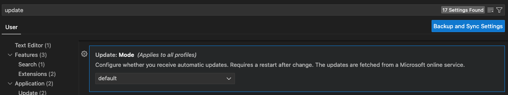
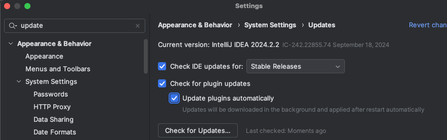

# [IDE] 1. Software 최신 패치 적용 점검

## Menu 
- **VSCode** 
    - Settings > User > Application > Update

- **IntelliJ**
    - Appearance & Behavior > System Settings > Updates

## 점검 방법 
소프트웨어에 대한 업데이트 최신화를 위한 설정이 활성화 되어 있는지 점검합니다. 

### VSCode

- `Mode`가 **default**로 설정합니다.

### IntelliJ

- `Check IDE updates for` 옵션을 활성화 체크합니다.

## 관련 통제 항목 (ISMS-P)
- 2.9.1 변경관리
- 2.10.1 보안시스템 운영
- 2.10.8 패치관리