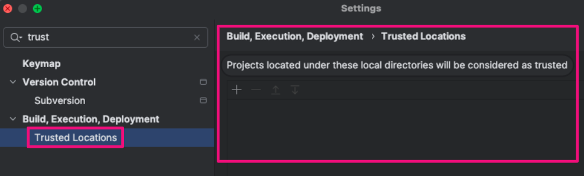

# [IDE] 3. 신뢰할 수 있는 작업 영역 및 폴더 설정 점검

## Menu 
- **VSCode** 
    - Settings > User > Security > Workspace

- **IntelliJ**
    - Build, Execution, Deployment > Trusted Locations

## 점검 방법 
소프트웨어에 대한 자동 업데이트 설정이 활성화 되어 있는지 점검합니다. 

### VSCode
IDE가 시스템 폴더 및 파일에 접근 시 신뢰할 수 있는 영역 확인 옵션을 활성화 체크합니다.

- `Trust: Empty Window`: 체크 해제
    - 빈 창에서는 추가적인 신뢰 확인 없이 작업이 진행되기 때문에, 끄는 것이 더 안전합니다.
- `Trust: Enable`: 체크
    - 이 설정을 켜두면 VSCode가 워크스페이스에 대한 신뢰 여부를 관리해주므로, 보안 위험을 최소화할 수 있습니다. 
    - 신뢰할 수 없는 코드가 실수로 실행되지 않도록 방지하는 역할을 합니다.
- `Trust: Startup Prompt`: once 또는 always
    - 보안성을 높이려면 항상 (Always) 설정하여, VSCode가 매번 새 프로젝트를 시작할 때 신뢰 여부를 확인하는 것이 좋습니다. 
    - 이를 통해 의심스러운 프로젝트나 파일을 열기 전에 경고를 받을 수 있습니다.
- `Trust: Untrusted Files`: prompt
    - 신뢰할 수 없는 파일을 열 때 경고를 보여주도록 설정하는 것이 좋습니다. 

### IntelliJ
Build, Execution, Deployment > Trusted Locations 내 저장된 신뢰할 수 있는 로컬 디렉터리 위치를 점검합니다. 

## 관련 통제 항목 (ISMS-P)
- 2.9.1 변경관리
- 2.10.1 보안시스템 운영