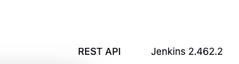

# [Jenkins] 1. 시스템 버전 최신화 여부

## Menu 
Dashboard

## 점검 방법 
Jenkins 홈페이지에서 제공하는 최신버전과 현재 운영 중인 버전을 앱 우측 맨 하단에서 확인하고 비교하여 최신 버전을 사용하는지 체크하고 정기적으로 최신화를 이행합니다. 

- 최신 버전 확인: https://www.jenkins.io/changelog-stable

## 관련 통제 항목 (ISMS-P)
- 2.9.1 변경관리
- 2.10.1 보안시스템 운영
- 2.10.8 패치관리