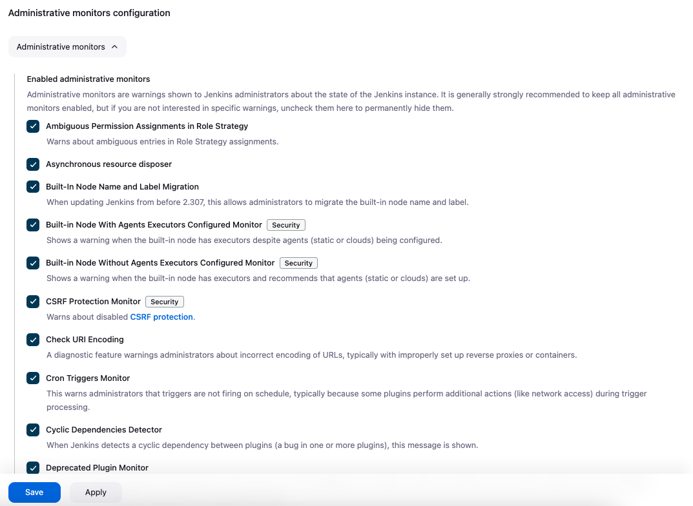

# [Jenkins] 3. 관리 모니터링 및 알림 활성화 여부

## Menu 
Dashboard > Manage Jenkins > System

## 점검 방법 
**Administrative monitors configuration** 내 필요한 알림 항목을 활성화하여 모니터링을 진행하고 이에 대한 관리 프로세스를 이행하는지 검토합니다. 

가급적 모든 항목에 대한 알림을 활성화하고, `[Security]` 태그가 붙은 항목은 모두 체크합니다. 

## 관련 통제 항목 (ISMS-P)
- 2.9.4 로그 및 접속기록 관리
- 2.9.5 로그 및 접속기록 점검
- 2.10.1 보안시스템 운영
- 2.11.1 사고 예방 및 대응체계 구축
- 2.11.3 이상행위 분석 및 모니터링