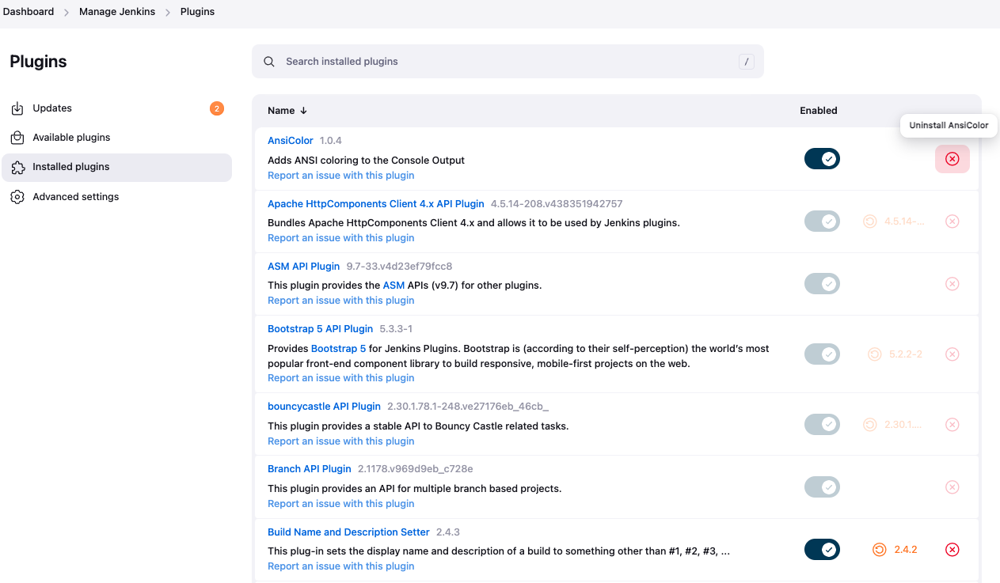

# [Jenkins] 5. 플러그인 버전 최신화 여부

## Menu 
Dashboard > Manage Jenkins > Plugins

## 점검 방법 
**Updates** 메뉴 내 버전 업데이트가 필요한 플러그인에 대한 조치 알림을 확인합니다.  
조회되는 항목이 있다면 해당 플러그인 버전 최신화를 우측 상단의 `Update`버튼을 통해 진행합니다.  
이에 따른 내부 변경관리 프로세스를 이행하고 있는지 함께 확인합니다.

---

**Installed plugins** 메뉴 내 삭제불가한 플러그인을 제외한 설치 플러그인 중 활성화되지 않은 플러그인은 우측 `X`버튼을 클릭하여 제거합니다. 

## 관련 통제 항목 (ISMS-P)
- 2.9.1 변경관리
- 2.10.8 패치관리