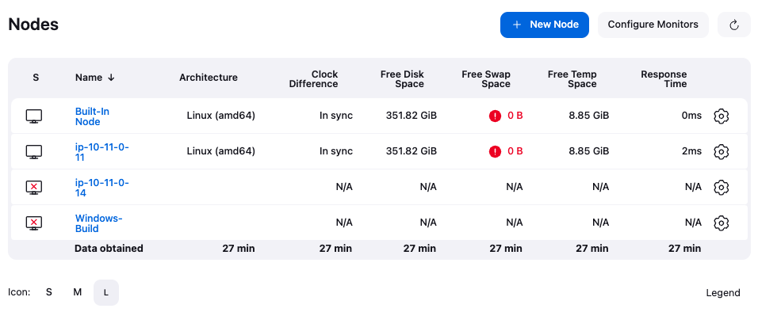

# [Jenkins] 6. 연결 노드 관리 현황 검토

## Menu 
Dashboard > Manage Jenkins > Nodes

## 점검 방법 
Nodes 목록에서 연결된 각 노드 현황을 검토합니다. 

- S: 테이블 좌측 아이콘 중 Offline으로 표기된 노드가 있는지 확인하고, 해당 노드에 대한 에이전트의 Online 전환 조치 또는 제거합니다.  
(이슈 확인은 각 노드 내 Log 메뉴에서 확인 가능합니다.)
- Clock Difference: 모든 노드에 대한 시간 동기화 (In sync) 여부를 확인합니다. 
- Free Disk/Swap/Temp Space: 여유 저장 공간 크기가 기존 운영 대비 적절한지 확인합니다. 

*Clouds 사용 시 비슷한 맥락으로 검토합니다.

## 관련 통제 항목 (ISMS-P)
- 2.9.4 로그 및 접속기록 관리
- 2.9.5 로그 및 접속기록 점검
- 2.9.6 시간 동기화
- 2.10.1 보안시스템 운영
- 2.10.2 클라우드 보안