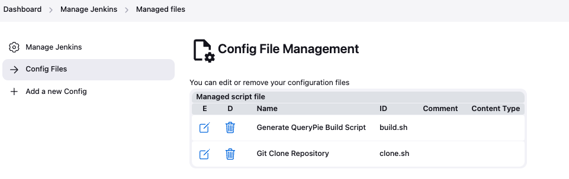

# [Jenkins] 7. 컨피그 파일/스크립트 현황 검토

## Menu 
Dashboard > Manage Jenkins > Managed files

## 점검 방법 
`E` 링크를 클릭하여 각 스크립트 파일 별 Content 내 하드코딩된 credential은 없는지 검토하여 조치합니다. 

## 관련 통제 항목 (ISMS-P)
- 2.10.1 보안시스템 운영