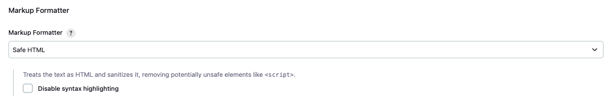

# [Jenkins] 11. 크로스 사이트 스크립팅 공격 대응 설정 활성화 여부

## Menu 
Dashboard > Manage Jenkins > Security

## 점검 방법 
Jenkins에 계정이 있는 모든 사용자는 작업, 뷰 또는 빌드와 같은 객체에 대한 자신의 description을 표시할 수 있습니다.  
사용자 입력을 HTML 그대로 렌더링하는 Plain Text와 같은 마크업 포매터를 사용하면 크로스 사이트 스크립팅 공격이 허용될 수 있으므로 이에 대한 보안 설정을 활성화합니다. 

- Markup Formatter : **Safe HTML** 활성화.

## 관련 통제 항목 (ISMS-P)
- 2.10.1 보안시스템 운영
- 2.10.2 클라우드 보안