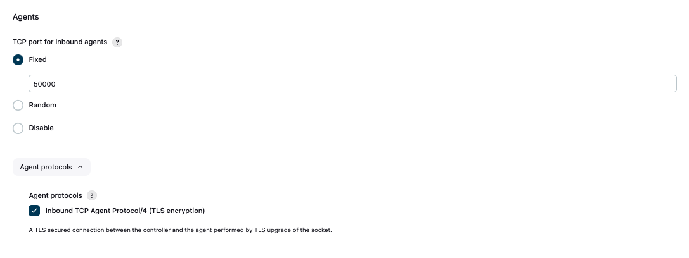

# [Jenkins] 12. 에이전트 포트 할당 및 TLS 암호화 통신 설정 여부

## Menu 
Dashboard > Manage Jenkins > Security

## 점검 방법 
Jenkins 인바운드 에이전트 사용 시에 해당합니다.  
방화벽이 임의의 포트를 보호하는 것은 어렵기 때문에 대신 고정 포트 번호를 지정하고 방화벽을 그에 따라 구성하여 관리하는지 검토합니다.  
또한, 해당 인바운드 통신에 대한 TLS 암호화를 설정합니다.

- TCP port for inbound agents : **Fixed** (에이전트 미사용 시, **Disable**)
- Agent protocols : **Inbound TCP Agent Protocol/4 (TLS encryption)**

## 관련 통제 항목 (ISMS-P)
- 2.5.5 특수 계정 및 권한 관리
- 2.10.1 보안시스템 운영
- 2.10.2 클라우드 보안