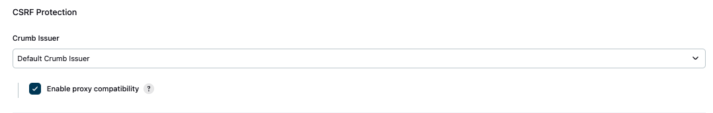

# [Jenkins] 13. CSRF 웹 애플리케이션 취약점 보호 설정 활성화 여부

## Menu 
Dashboard > Manage Jenkins > Security

## 점검 방법 
Jenkins에서 생성하여 사용자에게 전송하는 토큰(Crumb)에 대한 CSRF 보호 설정을 적용합니다.

- CSRF Protection : 플러그인 설치를 통해 **Strict Crumb Issuer**로 설정합니다. 
- Enable proxy compatibility : **체크**
    - Jenkins가 리버스 프록시 뒤에서 실행 중이고 Jenkins에서 보이는 사용자 IP 주소가 정기적으로 변경될 시, 체크하여 토큰에서 사용자 IP 주소에 대한 정보를 제거합니다.

## 관련 통제 항목 (ISMS-P)
- 2.5.6 접근권한 검토
- 2.10.1 보안시스템 운영
- 2.10.2 클라우드 보안