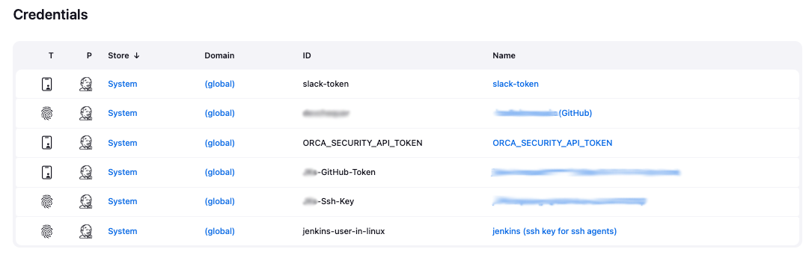

# [Jenkins] 16. 시스템 내 크리덴셜 보관 현황 검토

## Menu 
Dashboard > Manage Jenkins > Credentials

## 점검 방법 
연동용 API 토큰 등 시스템에 저장된 자격 증명에 대한 주기적 관리 및 검토 프로세스가 이행되고 있는지 확인합니다.  

더 이상 사용하지 않거나 만료된 자격 증명에 대해서 모두 업데이트 혹은 제거합니다.  
각 `Name`을 클릭하면 **Usage** 페이지로 이동되며 해당 크리덴셜이 사용되고 있는지 여부를 확인할 수 있습니다. 

## 관련 통제 항목 (ISMS-P)
- 2.5.5 특수 계정 및 권한 관리
- 2.6.3 응용프로그램 접근
- 2.7.2 암호키 관리
- 2.10.1 보안시스템 운영