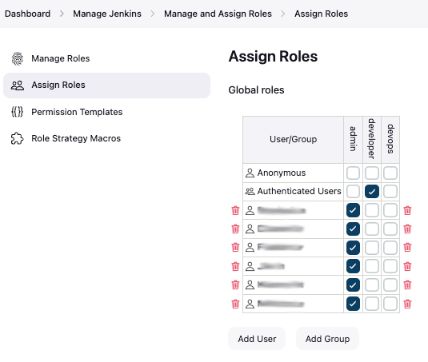

# [Jenkins] 17. 역할 권한 및 사용자/그룹 권한 부여 현황 검토

## Menu 
Dashboard > Manage Jenkins > Manage and Assign Roles

## 점검 방법 
각 사용자/그룹 별 역할에 맞는 최소한의 권한(Role)이 부여되어 있는지 검토합니다.

**Manage Roles** 메뉴에서 각 역할 별 권한이 어떻게 정의되어 있는지 확인합니다. 

**Assign Roles** 메뉴에서 각 사용자/그룹 별 부여된 권한의 적정성을 판단하여 최소한의 권한을 부여합니다. 

- **Anonymous**에는 특별한 사유 없이 Role을 할당하지 않습니다. 

## 관련 통제 항목 (ISMS-P)
- 2.5.1 사용자 계정 관리
- 2.5.6 접근권한 검토
- 2.6.3 응용프로그램 접근
- 2.9.1 변경관리
- 2.10.1 보안시스템 운영