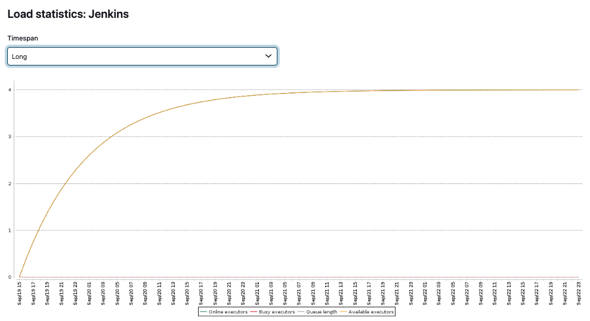

# [Jenkins] 18. 시스템 현황 정보 관리 여부

## Menu 
Dashboard > Manage Jenkins > System Information / Load Statistics

## 점검 방법 
**System Information** > `Memory Usage`, **Load Statistics** 등 시스템의 현황 정보를 주기적으로 검토하여 이상이 없는지 관리하는 프로세스를 수립하고 이행하고 있는지 검토합니다.  

- Grafana와 같은 모니터링 도구를 이용하여 Jenkins의 가시성 있는 모니터링을 수행하는지 검토합니다.
- 모니터링 관련 플러그인 (예: Prometheus)가 설치 및 구성되어 있는지 검토합니다. 

## 관련 통제 항목 (ISMS-P)
- 2.9.2 성능 및 장애관리
- 2.9.4 로그 및 접속기록 관리
- 2.9.5 로그 및 접속기록 점검