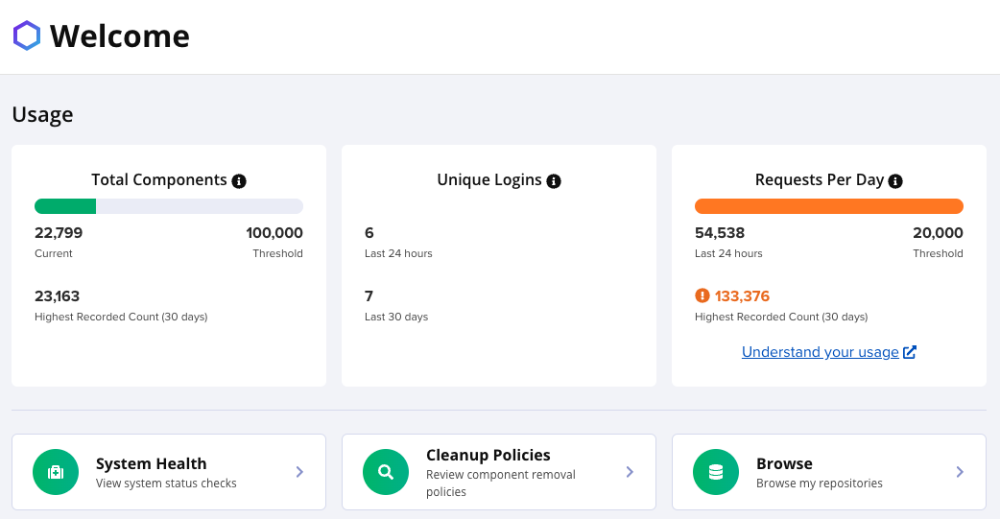

# [Nexus] 2. 서비스 운영 관리 현황 검토

## Menu 
Welcome

## 점검 방법 
**Usage** 위젯 내 **Total Components** 및 **Requests Per Day** 등 적절한 `Threshold` 옵션을 구독하여 운영 중인지 검토합니다. 

**Usage** 위젯 하단의 `System Health` 버튼 클릭을 통해 Administration > Support > Status 탭으로 이동하여 시스템 현황 내 오류 발생 건에 대한 검토 및 대응 프로세스가 이행되고 있는지 검토합니다. 

- 모두 체크되어 있고 ERROR 컬럼이 비어있다면 정상. 

## 관련 통제 항목 (ISMS-P)
- 2.9.2 성능 및 장애관리
- 2.10.1 보안시스템 운영
- 2.10.2 클라우드 보안