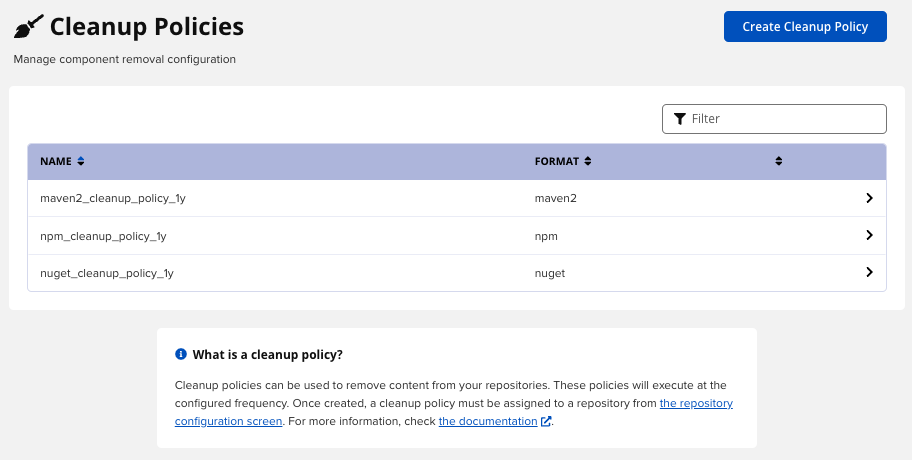
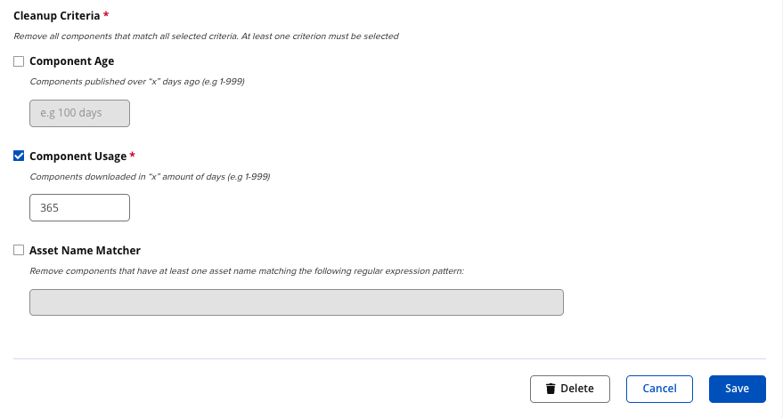

# [Nexus] 5. 장기간 미사용 컴포넌트 관리 현황 검토

## Menu 
Administration > Repository > Cleanup Policies

## 점검 방법 
저장소 인스턴스에서 사용되지 않는 구성 요소를 자동으로 삭제하는 정책의 유무를 검토합니다.

내부 보안 지침에 따른 각 정책 별 Cleanup Criteria 설정 현황을 검토합니다. 

## 관련 통제 항목 (ISMS-P)
- 2.9.7 정보자산의 재사용 및 폐기
- 2.10.1 보안시스템 운영