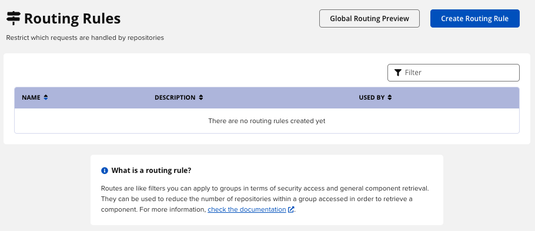

# [Nexus] 6. 주요 네임스페이스 노출 제한 규칙 설정 여부

## Menu 
Administration > Repository > Routing Rules

## 점검 방법 
각 레포지토리의 노출을 최소한으로 제한하기 위해 특정 주요 네임스페이스 주기적 정의 프로세스를 이행하고 있는지, 그리고 원격 프록시 액세스 제한 규칙 설정 여부를 검토합니다.

## 관련 통제 항목 (ISMS-P)
- 2.10.1 보안시스템 운영
- 2.10.3 공개서버 보안
- 2.11.1 사고 예방 및 대응체계 구축