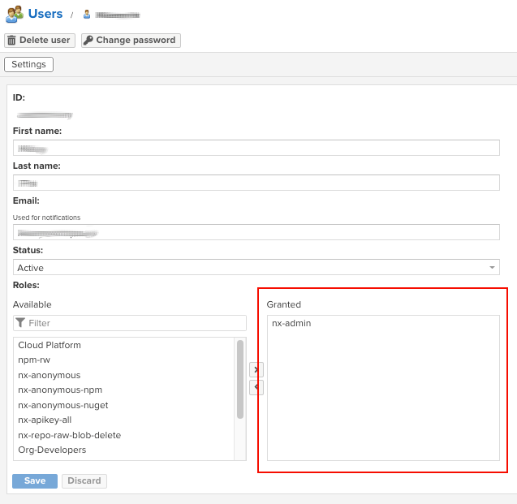

# [Nexus] 7. 사용자-그룹 권한 부여 현황 검토

## Menu 
Administration > Security > Users

## 점검 방법 
각 사용자 별 역할에 맞는 최소한의 권한(Role)이 부여되어 있는지 검토합니다. 

SAML/LDAP 연동 여부에 따라, 해당 그룹-역할 권한 매핑 현황 및 주기적 검토 현황을 확인합니다.

## 관련 통제 항목 (ISMS-P)
- 2.5.1 사용자 계정 관리
- 2.5.3 사용자 인증
- 2.5.6 접근권한 검토