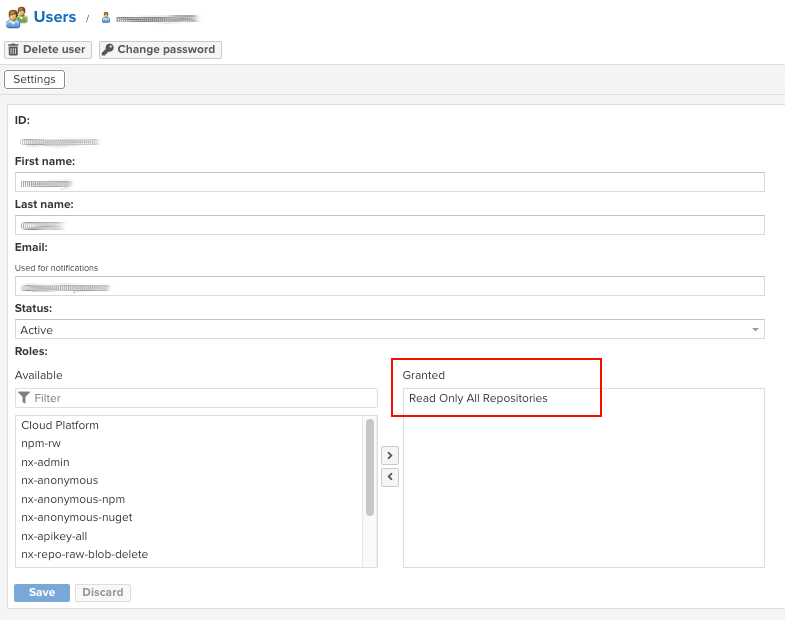

# [Nexus] 9. 시스템 계정 운영 현황 관리 여부

## Menu 
Administration > Security > Users

## 점검 방법 
목록 내 **시스템 계정**이 존재한다면, 해당 계정에 부여된 권한이 최소한의 권한으로 부여되어 있는지 검토.  
시스템 계정의 경우, 해당 목적과 지속 사용 여부를 검토하고 불필요한 계정은 제거합니다. 

## 관련 통제 항목 (ISMS-P)
- 2.5.1 사용자 계정 관리
- 2.5.5 특수 계정 및 권한 관리
- 2.5.6 접근권한 검토
- 2.6.3 응용프로그램 접근