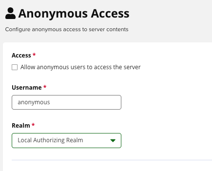

# [Nexus] 10. 저장소 익명 접근 방지 설정 여부

## Menu 
Administration > Security > Anonymous Access

## 점검 방법 
**Allow anonymous users to access the server** 옵션의 `체크박스 해제`를 통해 인증되지 않은 사용자가 인스턴스에 액세스하거나 저장소에서 구성 요소 다운로드 시도하는 것에 대한 방지합니다. 

## 관련 통제 항목 (ISMS-P)
- 2.5.5 특수 계정 및 권한 관리
- 2.5.6 접근권한 검토
- 2.6.3 응용프로그램 접근