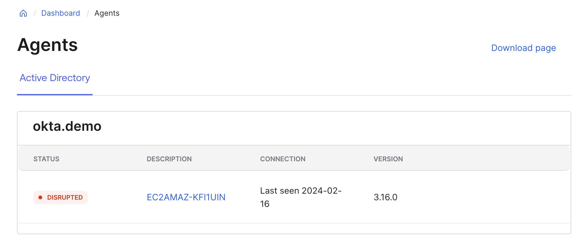

# [Okta] 2. 디렉터리 에이전트 관리 현황 검토

## Menu 
Dashboard > Agents

## 점검 방법 
**디렉터리 에이전트를 통한 AD/LDAP 연동 시에 해당합니다.**

- 각 에이전트 별 STATUS가 Operational로 정상 연결 여부를 확인합니다. 
    - Disrupted로 표기된 경우, 해당 에이전트 서버에 접속하여 에이전트 프로세스 및 네트워크 연결 현황을 검토합니다. 
    - 에이전트는 Active-Active 형식으로 동작하므로, Operational으로 동작하는 에이전트가 있다면 문제없이 동작할 수 있으나 가용성 확보를 설치된 에이전트는 모두 Operational하도록 조치하거나, 비활성화된 에이전트를 제거합니다.
- 각 에이전트의 버전의 VERSION의 최신화 여부를 검토합니다. 
    - Okta AD Agent 버전 현황은 [여기](https://help.okta.com/oie/en-us/content/topics/settings/version_histories/ver_history_ad_agent.htm?cshid=ver-hist-ad-agent)에서 조회 가능합니다. 
    - Okta LDAP Agent 버전 현황은 [여기](https://help.okta.com/oie/en-us/content/topics/settings/version_histories/ver_history_ldap_agent.htm)에서 조회 가능합니다.

## Subscription 
UD or SSO 

## 관련 통제 항목 (ISMS-P)
- 2.9.2 성능 및 장애관리
- 2.10.1 보안시스템 운영
- 2.10.8 패치관리