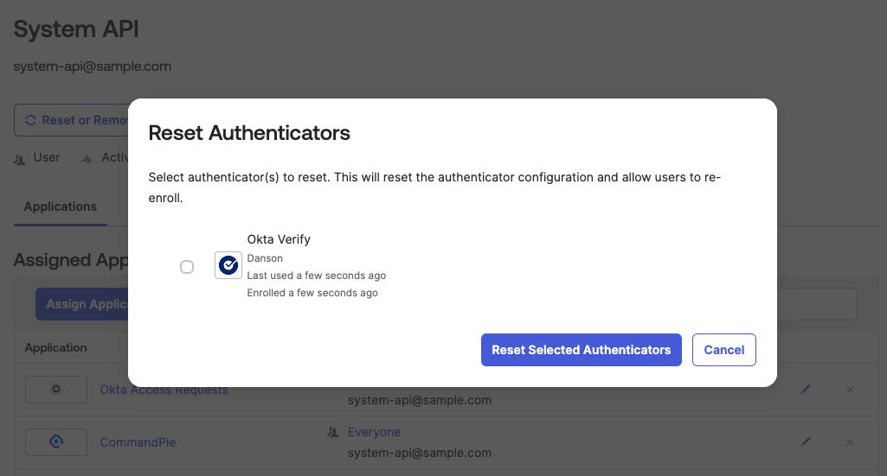

# [Okta] 4. 공용계정 운영 현황 검토

## Menu 
Directoy > People

## 점검 방법 
목록에서 일반 사용자 식별자와는 구분된 일반적인 네이밍 컨벤션과는 다른 계정은 없는지 검토하여 공용계정 유무를 확인합니다. (system, dev, api, admin 등의 키워드로 일반 사용자 계정에서 흔히 볼 수 없는 계정을 확인합니다.)

시스템 계정의 경우, 일반 사용자의 접근을 제한하고 있는지 검토합니다. 
MFA 설정 적용 시, 특정 오너 사용자의 권한으로만 접속이 가능한지 여부를 해당 계정의 상세 페이지에서 `More actions` > `Reset Authenticators` 버튼을 클릭하여 등록된 인증 요소를 검토합니다. 

만약 등록된 인증 요소의 오너가 사용자 본인 외 다수로 지정되어 있다면, 이에 대한 명확한 사유 및 접근 시 사유 관리가 철저히 이행되고 있는지 확인합니다.  

## Subscription 
Default

## 관련 통제 항목 (ISMS-P)
- 2.5.5 특수 계정 및 권한 관리
- 2.5.6 접근권한 검토
- 2.10.2 클라우드 보안