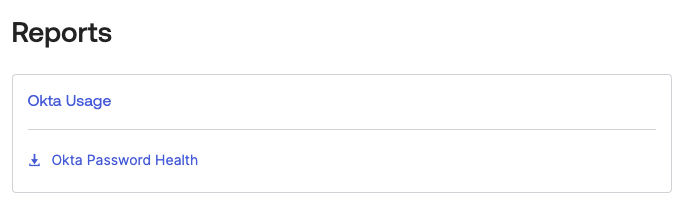
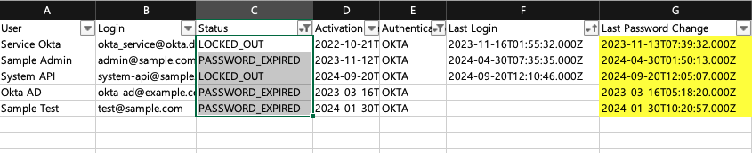

# [Okta] 5. 장기 미사용 계정 관리 여부

## Menu 
Directoy > People
Reports > Reports > Okta Password Health

## 점검 방법 
비밀번호 변경 주기 정책에 의해 계정의 비밀번호가 만료되었음에도 불구하고, 장기간 Password expired/Password reset/Locked out 상태의 계정 유무를 검토합니다. 

Reports > Reports > `Okta Password Health`의 마지막 로그인 기록을 기준으로 평가 혹은 별도 자동화 워크플로를 통해 관리 여부 검토합니다. 

다운로드 받은 엑셀 리포트를 열어 이하의 조건을 검색합니다. 

- **Status** : 필터 옵션 중 _LOCKED_OUT_, _PASSWORD_EXPIRED_, _RECOVERY_(_Password Reset에 해당_)가 있다면 해당 상태의 계정을 조회합니다. 
- **Last Password Change** : 마지막으로 비밀번호가 변경된 시점을 검토합니다. 장기간 변경이 없던 계정의 경우, 해당 계정의 비밀번호 변경 절차를 진행합니다. 
- **Last Login** : 마지막으로 로그인한 시점을 검토합니다. 
    - 장기간 접속 이력이 없던 계정의 경우, API만 지속적으로 사용되었을 수 있으니 `Security > API > Tokens` 탭 내 해당 계정에 의해 활성화된 API 토큰 내역이 있는지 확인하고, 없다면 해당 계정을 제거합니다. 
        -  토큰은 최근 30일 이내 사용 이력이 없으면 자동 소멸합니다. 
    - 타임스탬프가 조회되지 않는 계정의 경우, 해당 IdP에 로그인한 이력이 아예 없는 계정이므로 비활성화 및 삭제를 진행합니다. 

## Subscription 
Default

## 관련 통제 항목 (ISMS-P)
- 2.5.1 사용자 계정 관리
- 2.5.6 접근권한 검토