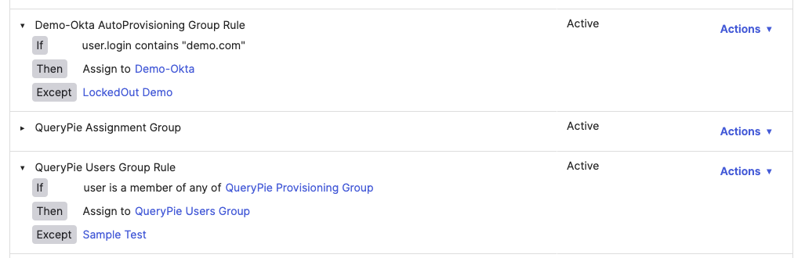

# [Okta] 6. 그룹 동적 할당 규칙 관리 현황 검토

## Menu 
Directory > Groups > Rules

## 점검 방법 
Status가 `Inactive`로 되어있는 그룹 규칙(Group Rules)은 없는지 검토합니다. 

만약 활성화되지 않은 규칙이 있다면, `Actions`에서 `Activate`를 클릭하여 활성화하거나 `Delete`를 클릭하여 제거합니다. 

각 그룹룰에 Except(예외)처리가 되어있는 사용자가 있는지 각 룰을 클릭하여 펼쳐 조회합니다. 예외 사용자가 조회될 시, 해당 룰에서 제외시킨 사유 관리가 이행되고 있는지 검토합니다.

## Subscription 
LCM

## 관련 통제 항목 (ISMS-P)
- 2.5.1 사용자 계정 관리
- 2.5.5 특수 계정 및 권한 관리
- 2.5.6 접근권한 검토
- 2.10.2 클라우드 보안