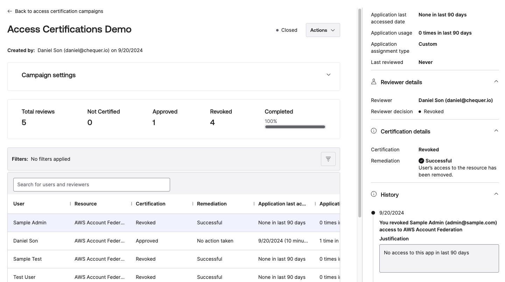

# [Okta] 9. 애플리케이션 별 사용자/그룹 권한 부여 관리 현황 검토

## Menu 
Applications > Applications

Reports > Reports > Application Usage

Identity Governance > Access Certifications

## 점검 방법 
각 애플리케이션 내 할당된 사용자의 접근 권한에 대한 주기적 검토를 진행하고 있는지 확인합니다. 

Reports > Reports > `Application Usage` 보고서 내 사용자들의 마지막 액세스 기록을 바탕으로 수동으로 각 애플리케이션에 대한 할당된 사용자 현황과 비교하여 장기간 미접속된 사용자에 대해서 권한을 회수합니다. 
- 최대 90일간의 이력을 보고서로 추출 가능합니다. 

---

**(OIG 사용 시)** `Identity Governance > Access Certifications`에서 `Closed` 캠페인을 통한 앱 또는 사용자 별 접근 권한에 대한 주기적 검토 내역을 통해 이행 여부의 확인 가능합니다. 

## Subscription 
(OIG)

## 관련 통제 항목 (ISMS-P)
- 2.5.5 특수 계정 및 권한 관리
- 2.5.6 접근권한 검토
- 2.9.5 로그 및 접속기록 점검
- 2.10.1 보안시스템 운영
- 2.10.2 클라우드 보안