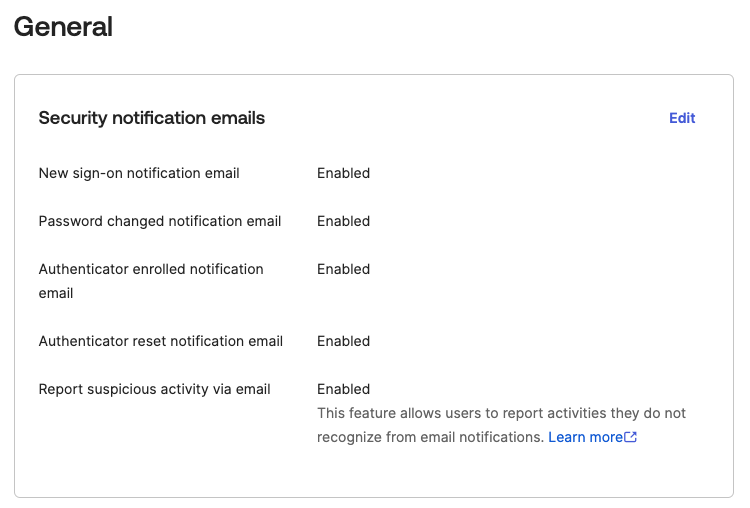

# [Okta] 10. 사용자 계정 보안 변경사항 알림 설정 여부

## Menu 
Security > General 

## 점검 방법 
**Security notification emails** 항목 내 비밀번호 변경, MFA 등록 등 변경사항에 대한 알림 및 신고 기능을 활성화하여 사용자 본인이 수행하지 않은 의심 활동에 대해서 신속한 조사 및 조치를 진행할 수 있도록 합니다. 

- Password changed notification email: **Enabled**
- Authenticator enrolled notification email: **Enabled**
- Authenticator reset notification email: **Enabled**
- Report suspicious activity via email: **Enabled**

## Subscription 
Default

## 관련 통제 항목 (ISMS-P)
- 2.5.1 사용자 계정 관리
- 2.5.4 비밀번호 관리
- 2.9.1 변경관리
- 2.10.1 보안시스템 운영
- 2.10.2 클라우드 보안