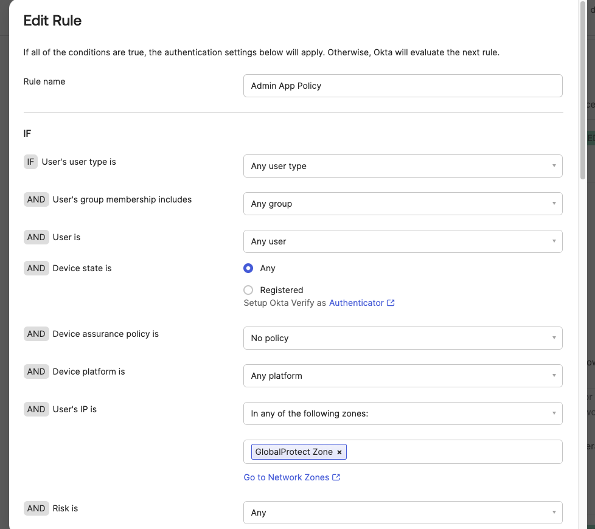
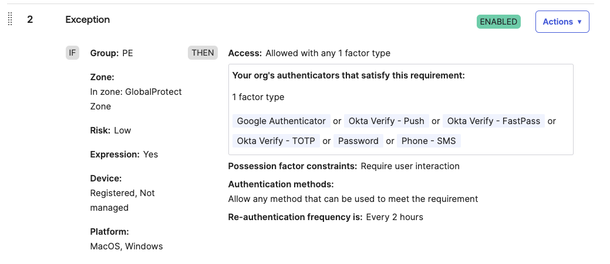

# [Okta] 11. 관리자 IP 접근에 대한 보안 설정 여부

## Menu 
Security > General 

Security > Authentication Policies > Okta Admin Console

## 점검 방법 
**Organization Security** 항목 내 관리자 콘솔 접속 시에 IP 변경 시 세션 종료 후 재인증 요구하는 기능을 활성화합니다. 

- IP binding for admin console: **Enabled** 

---

`Security > Authentication Policies > Okta Admin Console` 정책의 `Rules` 탭에서 IP ACL을 포함하여 허용된 IP대역에서만 접속을 허용하고 있는지 검토합니다. 

- User's IP is: **In any of the following zones**를 선택하여 사전에 `Security > Networks`에 정의한 특정 네트워크 존을 지정합니다. 

별도 예외처리된 정책 규칙이 존재한다면, 이에 대한 적용범위가 최소한으로 제한되어 있는지 여부 및 해당 규칙에 대한 정기적 검토가 이행되고 있는지 확인합니다. 

## Subscription 
Default

## 관련 통제 항목 (ISMS-P)
- 2.5.3 사용자 인증
- 2.5.6 접근권한 검토
- 2.10.1 보안시스템 운영
- 2.10.2 클라우드 보안