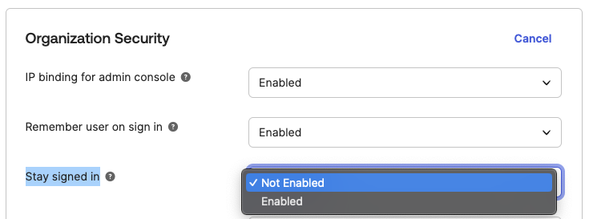

# [Okta] 12. 사용자 자동 로그인 인증 방지 설정 여부

## Menu 
Security > General 

## 점검 방법 
**Organization Security** 항목 내 브라우저 재오픈 시 기존 세션을 유지하고 MFA를 요구하지 않는 기능을 비활성화합니다. 

- Stay signed in: **Not enabled**

## Subscription 
Default

## 관련 통제 항목 (ISMS-P)
- 2.5.1 사용자 계정 관리
- 2.5.3 사용자 인증
- 2.10.1 보안시스템 운영
- 2.10.2 클라우드 보안