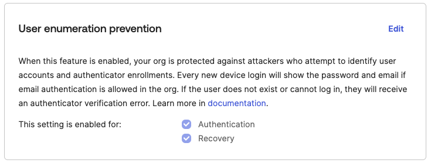

# [Okta] 15. 사용자 계정 추측 불가하도록 보안 설정 적용 여부

## Menu 
Security > General 

## 점검 방법 
사용자 계정 및 등록 인증요소를 식별하려는 공격자로부터 보호하기 위해 계정 존재유무 확인이 불가하도록 **User enumeration prevention** 항목에서 사용자 열거 방지 기능을 활성화합니다.

- This setting is enabled for: 
    - **Authentication**
    - **Recovery**

## Subscription 
Default

## 관련 통제 항목 (ISMS-P)
- 2.6.3 응용프로그램 접근
- 2.10.1 보안시스템 운영
- 2.10.2 클라우드 보안
- 2.11.1 사고 예방 및 대응체계 구축