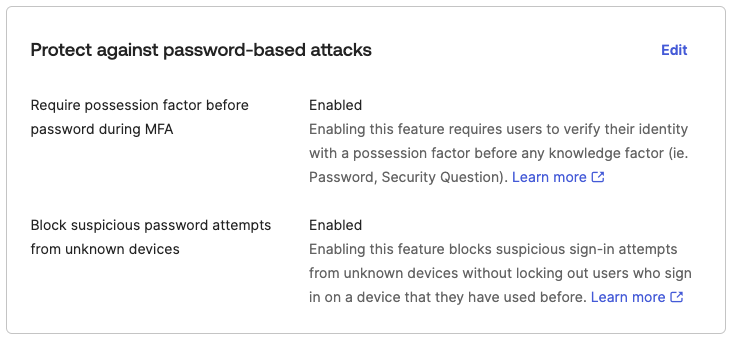

# [Okta] 16. 비밀번호 기반 공격 보호 기능 적용 여부

## Menu 
Security > General 

## 점검 방법 
**Protect against password-based attacks** 항목에서 비밀번호 추측 또는 스프레이 공격으로부터 보호하기 위해 이하의 설정을 활성화합니다. 

- Require possession factor before password during MFA: **Enabled**
- Block suspicious password attempts from unknown devices: **Enabled**

## Subscription 
Default

## 관련 통제 항목 (ISMS-P)
- 2.6.3 응용프로그램 접근
- 2.10.1 보안시스템 운영
- 2.10.2 클라우드 보안
- 2.11.1 사고 예방 및 대응체계 구축