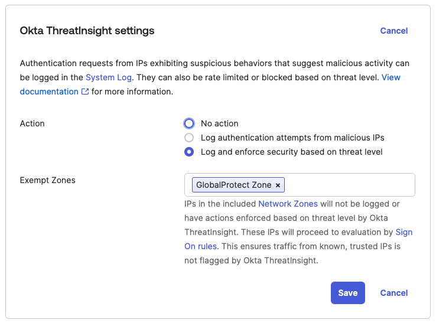

# [Okta] 17. 비인가된 접근 등을 추적/방지할 수 있도록 보호 기능 활성화 여부

## Menu 
Security > General 

## 점검 방법 
**Okta ThreatInsight settings** 항목에서 Action이 `No action`으로 비활성화되어 있지 않도록 로깅 및/또는 차단 설정을 적용합니다. 해당 기능을 활성화하여 악의적인 활동이 의심되는 행동을 보이는 IP로부터의 인증 요청은 시스템 로그에 기록 및 차단시킬 수 있습니다.

- **Log authentication attempts from malicious IPs** (로깅 활성화) 
- **Log and enforce security based on threat level** (로깅 및 차단)
    - 차단 설정 적용 시, `Security > Networks`에 정의해놓은 네트워크 존 예외처리를 함께 적용하여 오탐으로 인한 IP차단이 발생하지 않도록 함께 설정합니다. 

## Subscription 
SSO or MFA/AMFA

## 관련 통제 항목 (ISMS-P)
- 2.6.3 응용프로그램 접근
- 2.10.1 보안시스템 운영
- 2.10.2 클라우드 보안
- 2.11.1 사고 예방 및 대응체계 구축