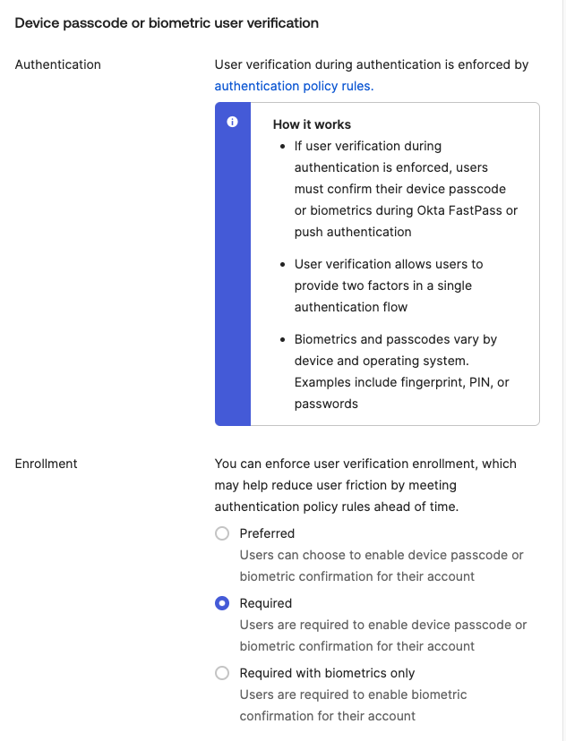
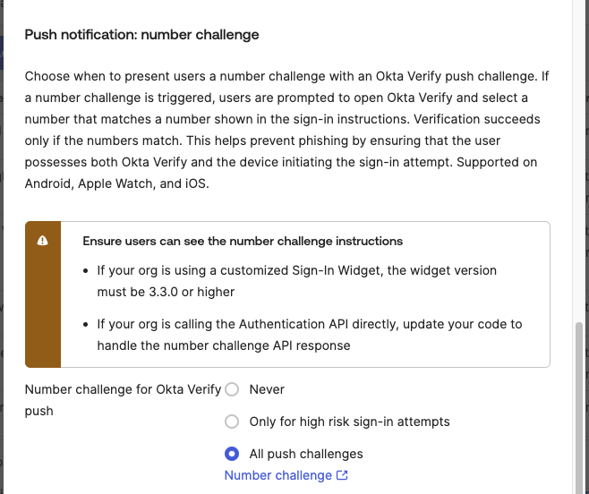

# [Okta] 19. 강력한 보안 인증요소 (MFA) 활성화 여부

## Menu 
Security > Authenticators > Setup

## 점검 방법 
`Okta Verify > Actions > Edit`에서 **Device passcode or biometric user verification** 항목의 `Enrollment` 설정이 **Required** 또는 **Required with biometrics only**로 설정합니다. 

만약 별도 강력한 보안 인증수단을 활성화하여 사용하고 있다면 이에 대한 설정을 검토합니다. 

**Push notification: number challenge** 항목의 설정을 **Only for high risk sign-in attempts** 또는 **All push challenges**로 활성화하여 Okta Verify Push에도 추가 지식 인증 요소를 더합니다. 

## Subscription 
SSO or MFA/AMFA

## 관련 통제 항목 (ISMS-P)
- 2.5.3 사용자 인증
- 2.5.4 비밀번호 관리
- 2.10.1 보안시스템 운영
- 2.10.2 클라우드 보안