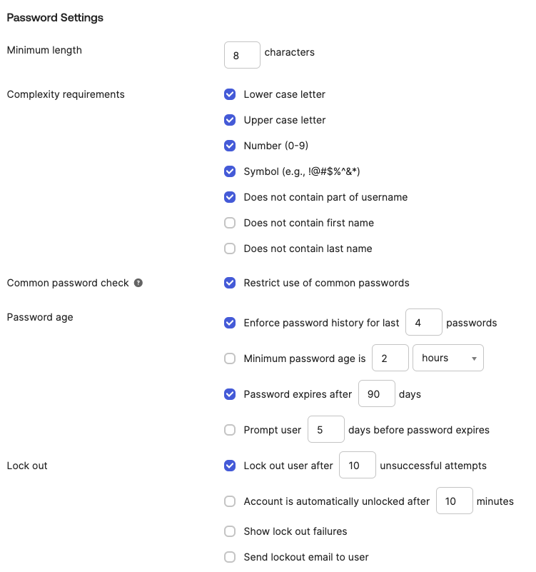
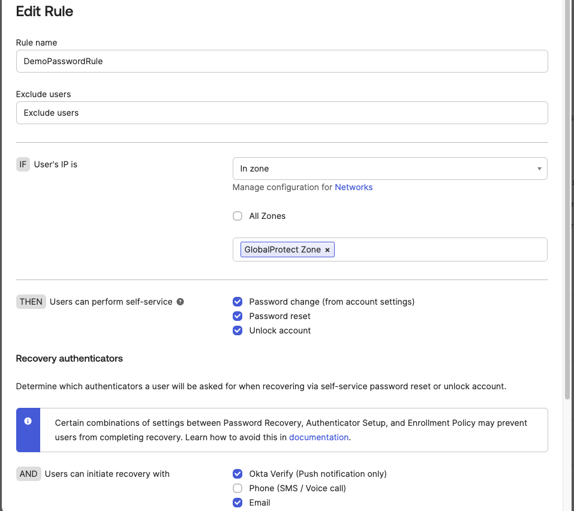
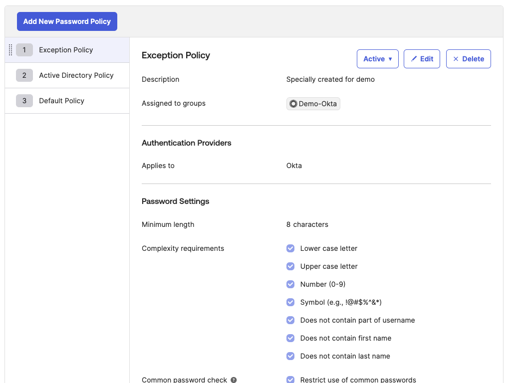

# [Okta] 20. 패드워드 보안 설정 준수 여부

## Menu 
Security > Authenticators > Setup

## 점검 방법 
`Password > Actions > Edit`에서 **Password Policy**에서 Default Policy 등 전체 사용자 대상으로 적용되는 정책의 비밀번호 규칙 및 보안 설정이 적정 수준을 준수하는지 검토합니다.

- Minimum length: >= **8 characters** 
    - (문자로만 설정 시 >= **10 characters**) 
- Complexity requirements: (가급적 모두 활성화)
    - **Lower case letter**
    - **Upper case letter**
    - **Number**
    - **Symbol**
    - **Does not contain part of username**  
- Common password check: **Restrict use of common passwords** 활성화
- Password age: (주기는 위험평가 결과 등을 고려하여 자체적으로 결정) 
    - **Enforce password history for last `{n}` passwords**
    - **Password expires after `{n}` days**
- Lock out: (횟수는 위험평가 결과 등을 고려하여 자체적으로 결정)
    - **Lock out user after `{n}` unsuccessful attempts**

---

비밀번호 변경/초기화 등의 작업은 가급적 특정 IP ACL 범위 내에서만 허용하는 Rule로 운영하도록 설정합니다. 

- IF User's IP is: **In zone** 설정
    - `Security > Networks`에 정의한 네트워크 존을 지정합니다. 

---

**Password Policy** 중 예외처리를 위한 정책이 있다면, 어떠한 그룹을 대상(`Assigned to groups`)으로 어떠한 사유(`Description`)로 생성된 정책인지 식별하고 구성된 보안 설정(`Password Settings`)을 검토합니다.

## Subscription 
Default

## 관련 통제 항목 (ISMS-P)
- 2.5.4 비밀번호 관리
- 2.7.1 암호정책 적용
- 2.10.1 보안시스템 운영
- 2.10.2 클라우드 보안