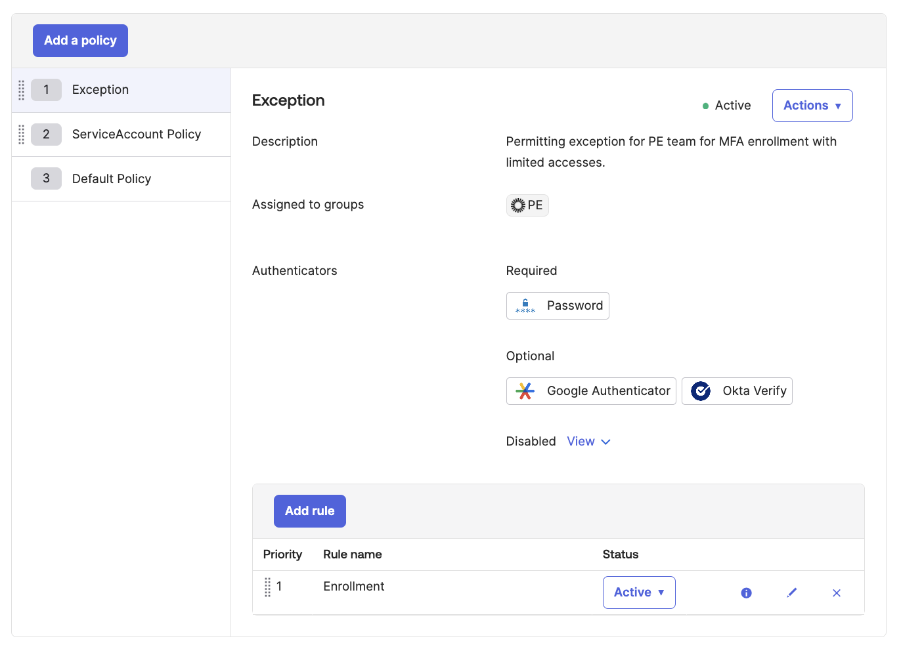
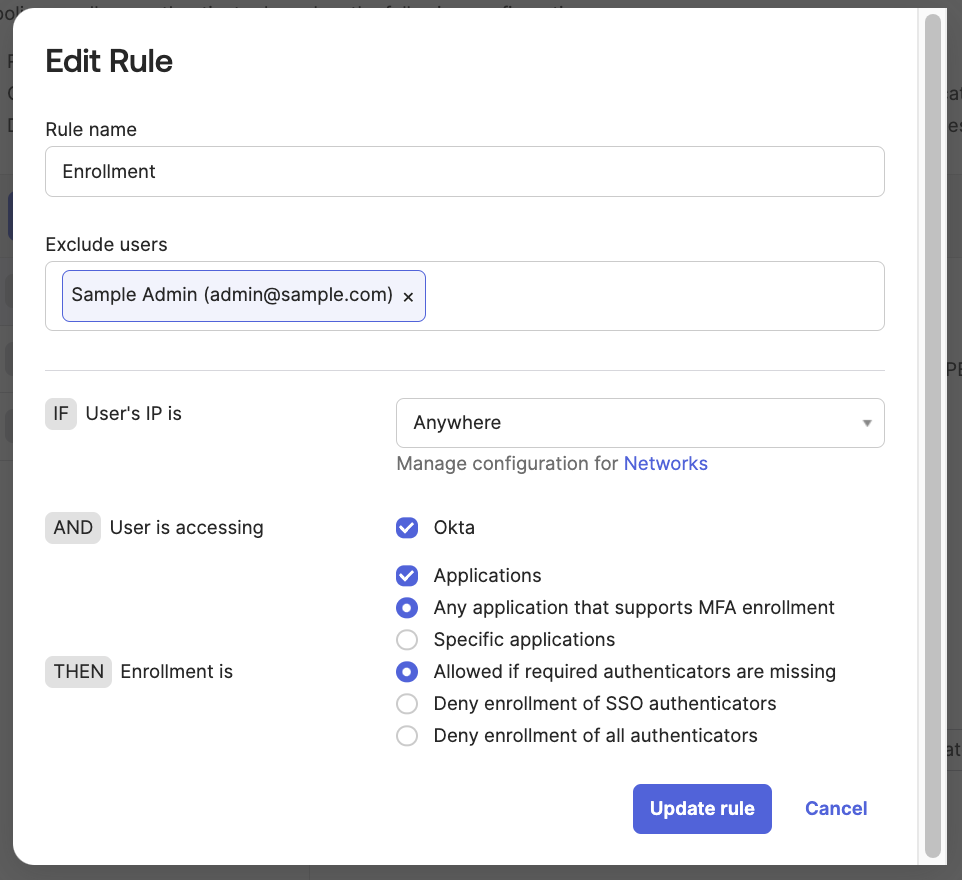

# [Okta] 21. MFA 등록 정책 관리 현황 검토

## Menu 
Security > Authenticators > Enrollment

## 점검 방법 
Default Policy 내 강제화 되어 있는 Authenticators 항목을 검토하여 Password 외 Okta Verify 등 추가 인증요소에 대한 사용자 등록 강제화가 적용되어 있는지 확인합니다. 

- Required 내 Password 외 2차인증에 사용할 인증수단이 최소 1개 이상 존재하는지 확인. 

---

Enrollment Policy 중 Default Policy 외 예외처리를 위한 정책이 있는지 확인하여, 해당 정책 별 어떠한 그룹을 대상으로 어떠한 사유로 생성된 정책인지 식별하고 강제화되어 있는 Authenticators 항목을 검토합니다. 

- Active하지 않은 정책의 경우 해당사항이 없습니다. 
- 목적이 불분명한 정책의 경우 `Actions`에서 `Deactivate` 또는 `Delete` 처리합니다. 

---

각 정책의 규칙 별 우측 연필 모양 버튼을 클릭하여 Excluded users에 예외가 적용된 사용자가 있다면 어떠한 사유로 예외되어 있는지 검토합니다. 

- 더욱 강화된 보안 규칙 적용을 위해 적용된 사용자 예외처리는 허용되나, 반드시 해당 규칙 하단에 예외 사용자가 적용 받을 강화된 규칙이 존재해야 합니다. 

## Subscription 
MFA/AMFA

## 관련 통제 항목 (ISMS-P)
- 2.5.3 사용자 인증
- 2.5.4 비밀번호 관리
- 2.10.1 보안시스템 운영
- 2.10.2 클라우드 보안