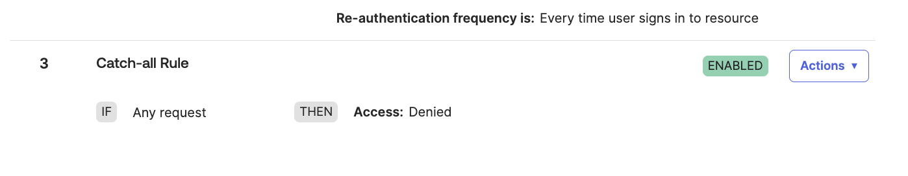

# [Okta] 22. 애플리케이션 인증 정책 현황 검토

## Menu 
Security > Authentication Policies

## 점검 방법 
메뉴 내 각 정책명을 클릭하여 Rules탭으로 이동하여 등록된 활성화 인증 규칙을 검토합니다. 

- Okta의 모든 규칙은 Priority에 따라 방화벽과 같이 위에서 아래로 조건에 부합하는 규칙을 찾아 적용합니다. Default로 존재하는 맨 하단의 Catch-all Rule 룰은 All Deny로 설정합니다.

- Catch-all Rule 바로 상단의 규칙에는 2차 인증 보안 설정을 요구하도록 규칙을 설정합니다. 

    - THEN: 
        - User must authenticate with: **Allowed with password + another factor** 또는 **Allowed with any 2 factor types**
        - Prompt for authentication: **Every time user signs in to resource** 또는 재인증 주기 별도 설정 (**Every {n} hours**)

- 룰 상위에 별도 예외 룰이 존재한다면 어떠한 사용자/그룹 및 환경을 대상으로 어떠한 사유로 생성된 규칙인지 검토합니다. 

    - 해당 정책이 특정 사용자/그룹 또는 특정 환경에 제한되지 않고 모든 사용자에게 적용될 규칙이라면 해당 규칙은 Default룰과 다름 없어지므로 상기 명시된 규칙의 설정이 적용되어야 합니다. 
    - 특정 조건에 대한 예외 규칙일 경우, 해당 조건에 대한 규칙 완화 적절성 여부를 검토하여 진행한 사항인지 별도 검토합니다. 

## Subscription 
SSO or MFA/AMFA

## 관련 통제 항목 (ISMS-P)
- 2.5.3 사용자 인증
- 2.5.6 접근권한 검토
- 2.6.3 응용프로그램 접근
- 2.10.1 보안시스템 운영
- 2.10.2 클라우드 보안