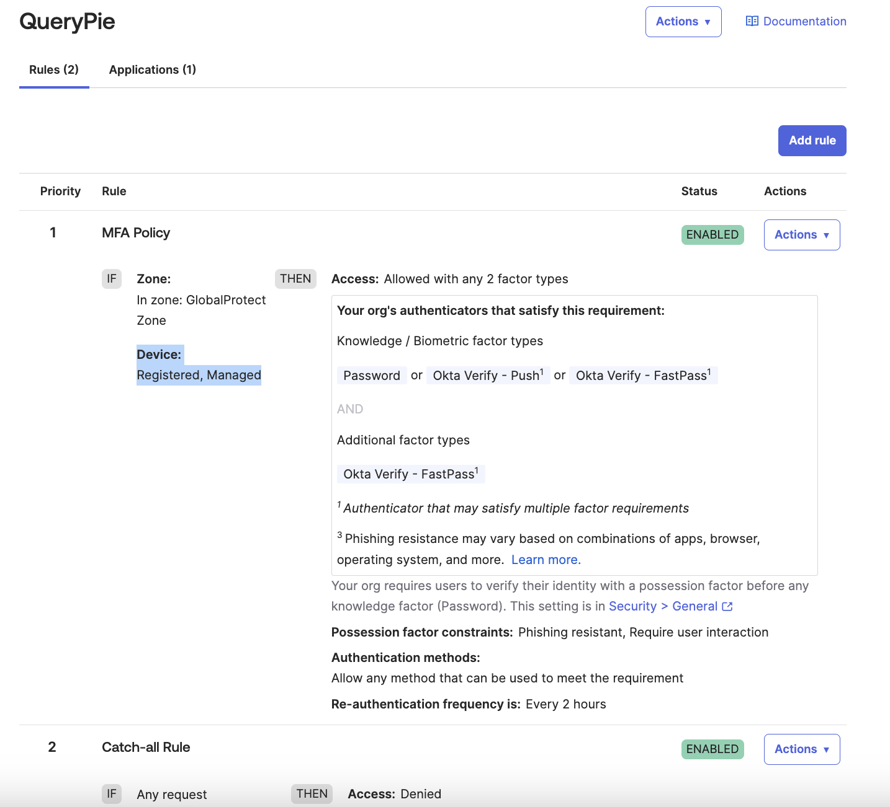

# [Okta] 23. 애플리케이션 인증 정책 별 디바이스 허용 규칙 적용 여부

## Menu 
Security > Authentication Policies

## 점검 방법 
메뉴 내 각 정책명을 클릭하여 Rules탭으로 이동하여 등록된 활성화 인증 규칙 내 이하의 보안 설정을 요구하도록 규칙이 적절하게 설정되어 있는지 검토합니다. 

_해당 설정을 이용하려면, 디바이스에 Okta Verify가 설정되어 있어야만 활용 가능합니다. (사용자 Okta FastPass 인증 필요)_

- IF: 
    - Device state is: **Registered** (Okta Verify를 통해 Okta에 등록된 디바이스로 한정)
    - *Device management is: 
        - **Managed** (MDM에서 관리하는 디바이스에 한정) 
        - **Not Managed** (Okta Verify가 등록된 사용자 개인 기기에서의 접근 포함)
    
_*Managed 디바이스 설정은 별도 Kandji, Jamf, Intune 등 별도 MDM 솔루션 사용 시에 해당하며, Adaptive MFA 라이선스 부재 시 해당 설정이 안보일 수 있습니다._

## Subscription 
MFA/(AMFA)

## 관련 통제 항목 (ISMS-P)
- 2.5.3 사용자 인증
- 2.5.4 비밀번호 관리
- 2.5.6 접근권한 검토
- 2.10.1 보안시스템 운영
- 2.10.2 클라우드 보안
- 2.10.6 업무용 단말기기 보안