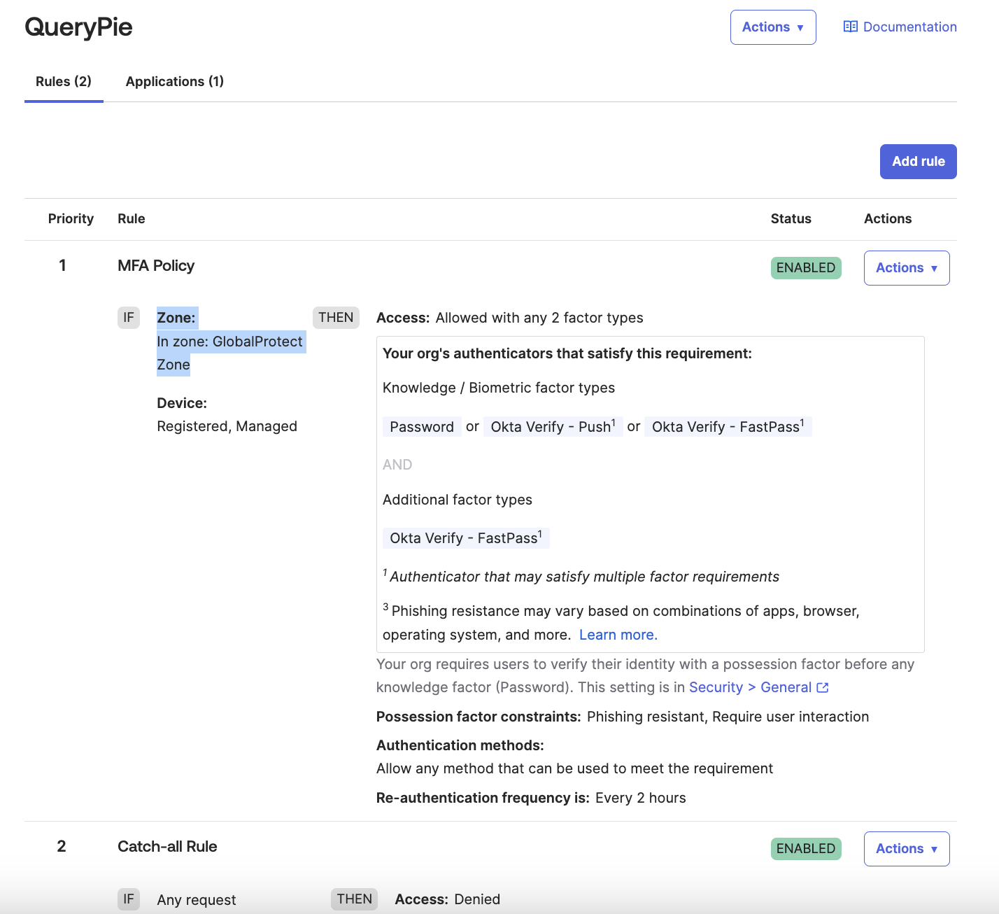

# [Okta] 24. 애플리케이션 인증 정책 별 IP ACL 규칙 적용 여부

## Menu 
Security > Authentication Policies

## 점검 방법 
메뉴 내 각 정책명을 클릭하여 Rules탭으로 이동하여 등록된 활성화 인증 규칙 내 이하의 보안 설정을 요구하도록 규칙이 적절하게 설정되어 있는지 검토합니다. 

- IF: 
    - User's IP is: `Security > Networks`에 정의된 ZeroTrust VPN or VPN을 바라보도록 네트워크 존을 설정합니다.

## Subscription 
SSO or MFA/AMFA

## 관련 통제 항목 (ISMS-P)
- 2.5.3 사용자 인증
- 2.5.5 특수 계정 및 권한 관리
- 2.5.6 접근권한 검토
- 2.10.1 보안시스템 운영
- 2.10.2 클라우드 보안