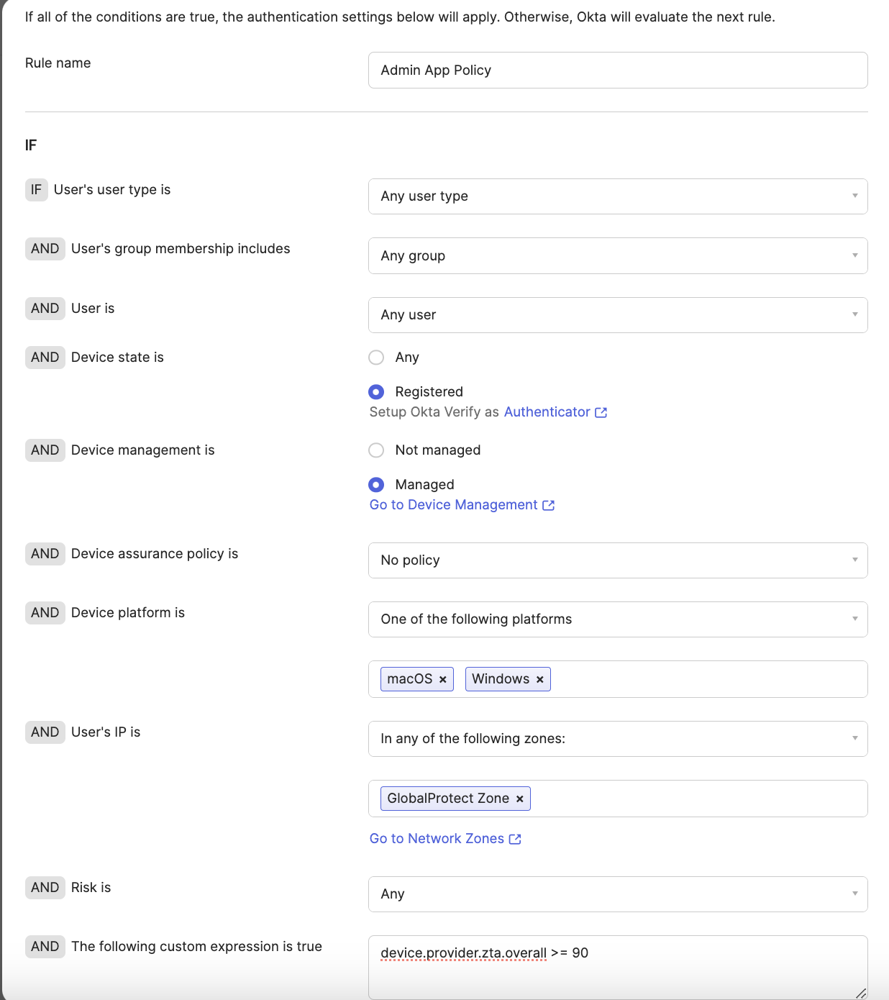

# [Okta] 26. 관리자 콘솔 접속 보안 정책 강화 여부 검토

## Menu 
Security > Authentication Policies > Okta Admin Console

## 점검 방법 
별도 관리자 콘솔 접속에 대한 강화된 보안 인증 정책을 관리자 대상으로 모두 적용하고 있는지 검토합니다. 

- IF: 
    - **Device 제한**을 통한 특정 디바이스에서만의 인증을 허용합니다. (MDM 사용 시 Managed 디바이스 설정*)
        - Device state is: **Registered** (Okta Verify를 통해 Okta에 등록된 디바이스로 한정)
        - *Device management is: 
            - **Managed** (MDM에서 관리하는 디바이스에 한정) 
    - **IP ACL** 적용을 통한 특정 네트워크 존에서만의 접속을 통제합니다. 
        - User's IP is: `Security > Networks`에 정의된 ZeroTrust VPN or VPN을 바라보도록 네트워크 존을 설정합니다.
    - 별도 **시그널**을 통한 추가 통제 보안을 적용합니다.
        - The following custom expression is true: 적절한 규정식 조건 적용 
            - https://help.okta.com/oie/en-us/content/topics/identity-engine/devices/el-device-attributes.htm 
            - https://help.okta.com/oie/en-us/content/topics/identity-engine/devices/edr-integration-available-signals.htm (지원되는 EDR 사용 시에 해당)
- THEN:
    - 2차 인증 보안 설정을 요구하도록 규칙을 설정합니다. 
        - User must authenticate with: **Allowed with password + another factor** 또는 **Allowed with any 2 factor types**
        - Prompt for authentication: **Every time user signs in to resource** 

Default로 존재하는 맨 하단의 Catch-all Rule 룰은 All Deny로 설정합니다.

## Subscription 
MFA/(AMFA)

## 관련 통제 항목 (ISMS-P)
- 2.5.5 특수 계정 및 권한 관리
- 2.6.3 응용프로그램 접근
- 2.10.1 보안시스템 운영
- 2.10.2 클라우드 보안