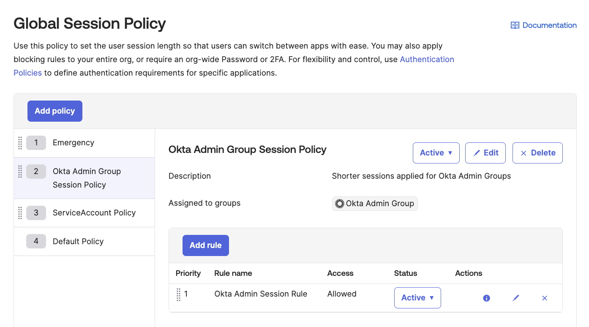

# [Okta] 27. 사용자 세션 통제 정책 현황 검토

## Menu 
Security > Global Session Policy

## 점검 방법 
Global Session Policy 내 Default Policy 외 별도 세션 정책이 있는지 확인합니다. 별도 정책이 있다면, 어떠한 그룹을 대상으로 어떠한 사유로 생성된 정책인지 식별하고 어떻게 주기적으로 관리하고 있는지 검토합니다. 

- **정책명**은 목적 식별이 가능한 이름으로 설정되었는지 확인합니다. 
- **Description**은 사유를 명확하게 서술하는지 검토합니다. 
- **Assigned to groups**는 세부적으로 대상을 한정하는 그룹으로 지정되어 있는지 검토합니다. 
- 좌측 패널에서 **Priority(우선순위)**에 따라 소수에 해당하는 그룹이 위에서부터 아래로 위치가 설정되어 있는지 검토합니다. 

## Subscription 
Default

## 관련 통제 항목 (ISMS-P)
- 2.5.3 사용자 인증
- 2.5.5 특수 계정 및 권한 관리
- 2.6.3 응용프로그램 접근
- 2.10.1 보안시스템 운영
- 2.10.2 클라우드 보안