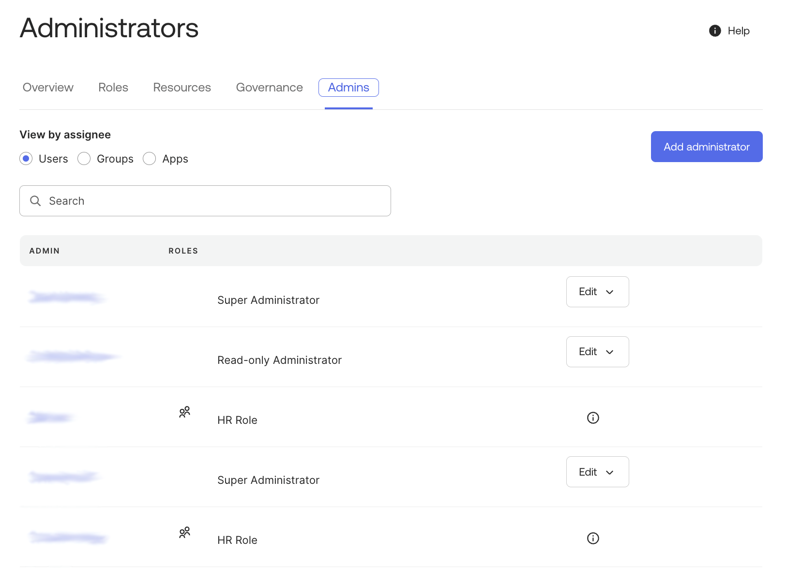

# [Okta] 32. 관리자 권한 부여 현황 검토

## Menu 
Security > Administrators 

## 점검 방법 
Admins 탭 내 관리자 권한이 시스템 오너, HR 등 필요한 사용자/시스템 계정(`ADMIN`)에 대해서만 권한이 부여되어 있는지 검토합니다. 각 사용자 또는 시스템 계정에게 부여된 권한이 필요한 최소한의 권한(`ROLES`)으로 부여되었는지 확인합니다. 

- Okta에서는 각 사용자에게 부여할 역할(Role) 및 관리 대상 범위(Resources)를 지정할 수 있어 세부적으로 권한 부여가 가능합니다. 
- 옥타 관리자 콘솔 내 Security 메뉴 접속을 위한 관리자 외에는 **Super Administrator** 권한을 부여하지 않습니다. 

## Subscription 
Default

## 관련 통제 항목 (ISMS-P)
- 2.5.1 사용자 계정 관리
- 2.5.5 특수 계정 및 권한 관리
- 2.5.6 접근권한 검토
- 2.10.1 보안시스템 운영
- 2.10.2 클라우드 보안