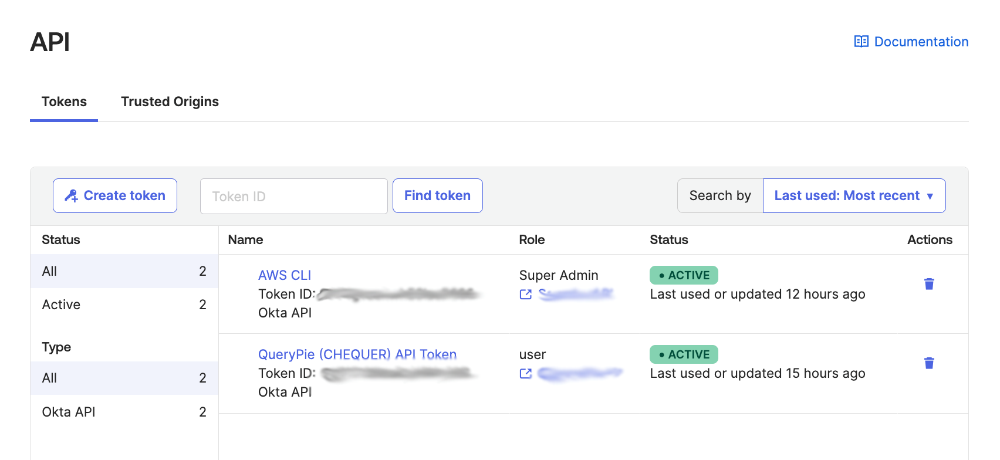
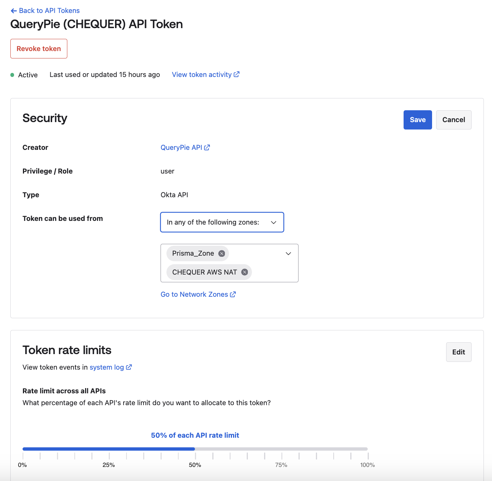

# [Okta] 33. 관리자 API Token 관리 및 보안 설정 여부

## Menu 
Security > API > Tokens 

## 점검 방법 
각 토큰 별 용도가 명확하게 구분하고 있는지 제목 또는 별도 관리리스트를 검토합니다. 

- 초기 생성 시 해당 API Token의 사용처/목적을 구분할 수 있는 이름으로 설정합니다.
- API 토큰은 생성자의 Okta 관리자 권한을 그대로 따라가므로 해당 권한이 목적에 따라 적절한지 검토합니다. 
- Status에서 마지막으로 호출된 일시 체크가 가능하며, 30일동안 미사용된 토큰은 자동으로 시스템에서 파기됩니다. 

---
각 토큰명을 클릭하여 상세페이지로 이동하여 이하의 보안 설정이 적절히 반영되었는지 검토합니다. 

- Token can be used from: 토큰 별 네트워크 존 **IP ACL**을 적용합니다. 
- Rate limit access all APIs: 토큰 별 적정 수준의 **Token rate limits**를 적용합니다.

## Subscription 
Default

## 관련 통제 항목 (ISMS-P)
- 2.5.5 특수 계정 및 권한 관리
- 2.6.3 응용프로그램 접근
- 2.10.1 보안시스템 운영
- 2.10.2 클라우드 보안