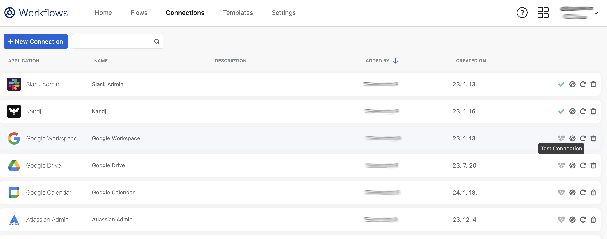

# [Okta] 34. 워크플로 연동 Connector 현황 검토

## Menu 
Workflow > Workflows console > Connections 

## 점검 방법 
각 커넥터 별 연결 활성화 여부 및 사용 현황을 확인합니다. 연결이 올바르지 않거나 미사용 중인 불필요한 커넥터는 모두 제거합니다. 

- 우측 하트 모양 Test Connection 아이콘을 눌러 연결 성공 여부를 체크합니다.  

- 우측 나침반 모앙 Usage 아이콘을 눌러 해당 커넥터를 사용중인 워크플로 유무를 체크합니다.

## Subscription 
Workflows/OIG

## 관련 통제 항목 (ISMS-P)
- 2.5.5 특수 계정 및 권한 관리
- 2.6.3 응용프로그램 접근
- 2.10.1 보안시스템 운영
- 2.10.2 클라우드 보안