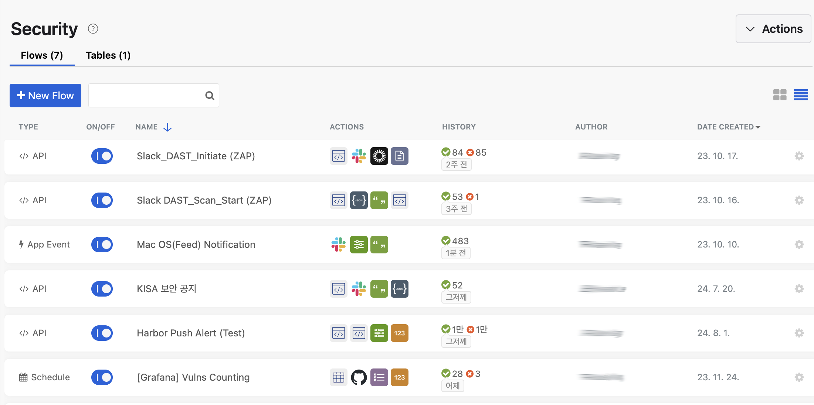
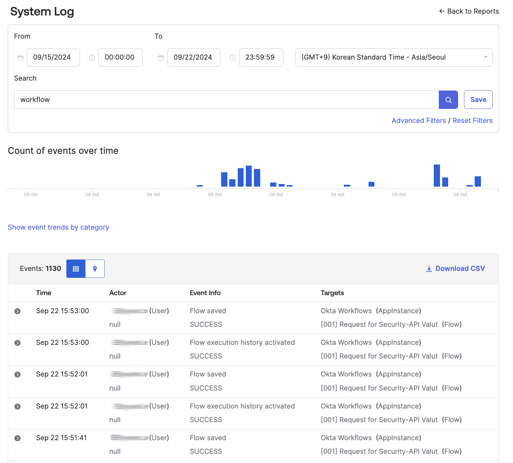

# [Okta] 35. 자동화 워크플로 관리 현황 검토

## Menu 
Workflow > Workflows console > Flows

## 점검 방법 
각 활성화된 워크플로 별 정상 동작 여부 및 최근 사용여부 등을 검토하여 불필요한 워크플로 제거합니다. 

- HISTORY 컬럼을 통해 마지막 호출 일시가 일정 수준을 넘긴 워크플로가 있는지 체크합니다. 
    - 내부 관리지침에서 정의한 일정 기간 이상 동안 미호출된 자동화 워크플로의 경우 `ON/OFF` 토글 비활성화 또는 우측 톱니바퀴 클릭 후 `Delete`을 클릭하여 삭제합니다. 
- HISTORY 컬럼을 클릭하여 특정 워크플로의 최근 30일 간 지속 오류가 발생한 워크플로가 있는지 체크. 
    - 중간 단계에서의 파싱 오류 등으로 인한 플로우 실패의 가능성이 높아 해당 자동화 플로우의 오류를 식별하여 수정합니다.
    
---
    
자동화 워크플로 유지보수에 따른 변경 이력 관리가 정기적으로 이행되고 있는지 확인합니다. 
- System Logs를 통한 감사로그 확인을 통한 변경 히스토리 관리가 가능합니다. 

## Subscription 
Workflows/OIG

## 관련 통제 항목 (ISMS-P)
- 2.5.5 특수 계정 및 권한 관리
- 2.6.3 응용프로그램 접근
- 2.9.1 변경관리
- 2.10.1 보안시스템 운영
- 2.10.2 클라우드 보안