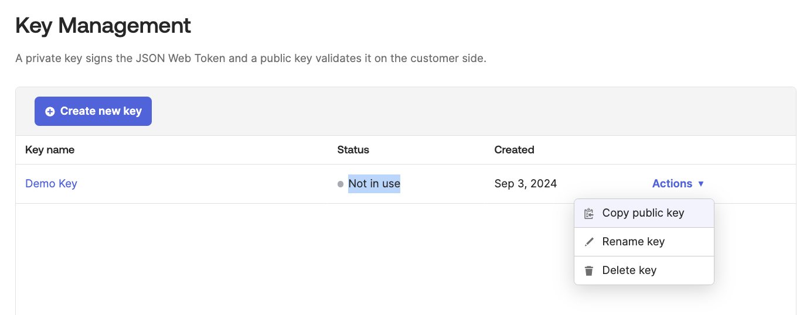

# [Okta] 36. 전용 키 발급 현황 검토

## Menu 
Workflow > Key Management

## 점검 방법 
OAuth 2.0 클라이언트 인증을 지원하는 JSON 웹 키(JWKS)를 옥타에서 생성 및 이용 시, 키 별 Status를 주기적으로 검토하여 불필요한 키는 제거합니다. 

암호키 생성, 이용, 보관, 배포, 변경, 복구, 파기 등에 관한 프로세스를 내부 관리지침에 따라 이행하고 있는지 별도 검토합니다. 

## Subscription 
Default 

## 관련 통제 항목 (ISMS-P)
- 2.5.5 특수 계정 및 권한 관리
- 2.7.2 암호키 관리
- 2.10.1 보안시스템 운영
- 2.10.2 클라우드 보안